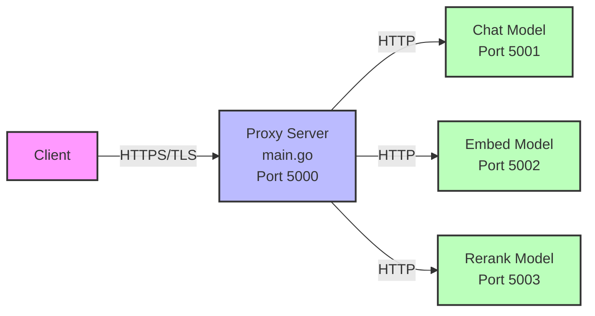

# VDH Multi-Model LLaMA Server

A high-performance, multi-model LLaMA server with HTTPS reverse proxy, compression support, and GPU acceleration. This server can simultaneously serve chat, embedding, and reranking models through a unified interface.

## Features

- **Multi-Model Support**: Simultaneously serve chat, embedding, and reranking models
- **HTTPS with Self-Signed Certificates**: Automatic TLS certificate generation
- **Compression**: Zstandard (zstd) compression for request/response optimization
- **Authentication**: Optional Bearer token authentication
- **GPU Acceleration**: CUDA support for NVIDIA GPUs (12.2, 12.6, 12.9)
- **Request Routing**: Intelligent routing based on URL patterns or custom headers
- **Docker Support**: Pre-configured Docker images with different CUDA versions

## Configuration Options

### Proxy Server (main.go) Environment Variables

| Variable | Default | Description |
|----------|---------|-------------|
| `BEARER_TOKEN` | (empty) | Bearer token for authentication. If not set, authentication is disabled |
| `TARGET_URL_CHAT` | `http://localhost:5001` | Backend URL for chat/completion requests |
| `TARGET_URL_EMBED` | `http://localhost:5002` | Backend URL for embedding requests |
| `TARGET_URL_RERANK` | `http://localhost:5003` | Backend URL for reranking requests |
| `LISTEN_ADDR` | `:5000` | Address and port for the proxy server to listen on |

### Docker Build Arguments

These arguments are used during the Docker image build process to specify which models to download:

| Argument | Default | Description |
|----------|---------|-------------|
| `MODEL_REPO_CHAT` | `unsloth/gemma-3-12b-it-GGUF` | Hugging Face repository for chat model |
| `MODEL_FILE_CHAT` | `gemma-3-12b-it-UD-Q4_K_XL.gguf` | Chat model filename |
| `MODEL_REPO_EMBED` | `unsloth/embeddinggemma-300m-GGUF` | Hugging Face repository for embedding model |
| `MODEL_FILE_EMBED` | `embeddinggemma-300M-BF16.gguf` | Embedding model filename |
| `MODEL_REPO_RERANK` | `mradermacher/jina-reranker-v1-tiny-en-GGUF` | Hugging Face repository for reranking model |
| `MODEL_FILE_RERANK` | `jina-reranker-v1-tiny-en.f16.gguf` | Reranking model filename |

### Runtime Environment Variables

These variables control the LLaMA server runtime behavior when the container starts:

#### General Settings

| Variable | Default | Description |
|----------|---------|-------------|
| `THREADS` | `8` | Number of CPU threads to use |
| `THREADS_BATCH` | `8` | Number of threads for batch processing |
| `N_GPU_LAYERS` | `9999` | Number of layers to offload to GPU (9999 = all) |
| `CACHE_TYPE_K` | `q4_0` | Quantization type for K cache |
| `CACHE_TYPE_V` | `q8_0` | Quantization type for V cache |

#### Chat Model Settings

| Variable | Default | Description |
|----------|---------|-------------|
| `CTX_SIZE_CHAT` | `16384` | Context size for chat model |
| `BATCH_SIZE_CHAT` | `512` | Batch size for chat model |
| `PARALLEL_CHAT` | `2` | Number of parallel requests for chat model |
| `MODEL_PATH_CHAT` | (auto-set) | Path to chat model file (set automatically by Docker) |

#### Embedding Model Settings

| Variable | Default | Description |
|----------|---------|-------------|
| `CTX_SIZE_EMBED` | `16384` | Context size for embedding model |
| `BATCH_SIZE_EMBED` | `2048` | Batch size for embedding model |
| `PARALLEL_EMBED` | `8` | Number of parallel requests for embedding model |
| `MODEL_PATH_EMBED` | (auto-set) | Path to embedding model file (set automatically by Docker) |

#### Reranking Model Settings

| Variable | Default | Description |
|----------|---------|-------------|
| `CTX_SIZE_RERANK` | `32768` | Context size for reranking model |
| `BATCH_SIZE_RERANK` | `2048` | Batch size for reranking model |
| `PARALLEL_RERANK` | `4` | Number of parallel requests for reranking model |
| `MODEL_PATH_RERANK` | (auto-set) | Path to reranking model file (set automatically by Docker) |

## Request Routing

The proxy automatically routes requests based on URL patterns or custom headers:

### URL Pattern Routing

- **Chat/Completion**: `/v1/completions`, `/v1/chat/completions`, `/completion`, `/complete`, `/infill`
- **Embeddings**: `/v1/embeddings`, `/embeddings`
- **Reranking**: `/v1/rerank`, `/v1/reranking`, `/rerank`, `/reranking`

### Header-Based Routing

You can override automatic routing using the `Query-Type` header:
- `Query-Type: chat` - Routes to chat model
- `Query-Type: embed` - Routes to embedding model
- `Query-Type: rerank` - Routes to reranking model

## Compression Support

The server supports Zstandard (zstd) compression for both requests and responses:

- **Request Compression**: Set `Content-Encoding: zstd` header
- **Response Compression**: Set `Accept-Encoding: zstd` header
- The proxy automatically handles compression/decompression between client and backend

## Authentication

When `BEARER_TOKEN` is set, all requests must include an Authorization header:
```
Authorization: Bearer <your-token>
```

## Docker Usage

### Building Images

Build with specific CUDA version:
```bash
# CUDA 12.2
./build-cuda12.2.sh

# CUDA 12.6
./build-cuda12.6.sh

# CUDA 12.9
./build-cuda12.9.sh
```

### Building with Custom Models

```bash
docker build \
  --build-arg MODEL_REPO_CHAT="your/chat-model-repo" \
  --build-arg MODEL_FILE_CHAT="your-chat-model.gguf" \
  --build-arg MODEL_REPO_EMBED="your/embed-model-repo" \
  --build-arg MODEL_FILE_EMBED="your-embed-model.gguf" \
  --build-arg MODEL_REPO_RERANK="your/rerank-model-repo" \
  --build-arg MODEL_FILE_RERANK="your-rerank-model.gguf" \
  -t vdh/vdh-multi:custom \
  -f cuda12.6/Dockerfile .
```

### Running Containers

Basic usage with GPU support:
```bash
docker run -p 5000:5000 --gpus all vdh/vdh-multi:cuda12.6
```

With custom configuration:
```bash
docker run \
  -e BEARER_TOKEN="your-secret-token" \
  -e CTX_SIZE_CHAT=8192 \
  -e BATCH_SIZE_CHAT=1024 \
  -e PARALLEL_CHAT=4 \
  -e N_GPU_LAYERS=35 \
  -e THREADS=16 \
  -p 5000:5000 \
  --gpus all \
  vdh/vdh-multi:cuda12.6
```

## API Examples

### Chat Completion

```bash
curl -k -X POST https://localhost:5000/v1/chat/completions \
  -H "Content-Type: application/json" \
  -H "Query-Type: chat" \
  -H "Authorization: Bearer your-token" \
  -d '{
    "model": "llama",
    "messages": [{"role": "user", "content": "Hello!"}]
  }'
```

### Embeddings

```bash
curl -k -X POST https://localhost:5000/v1/embeddings \
  -H "Content-Type: application/json" \
  -H "Query-Type: embed" \
  -H "Authorization: Bearer your-token" \
  -d '{
    "input": "Text to embed",
    "model": "embedding"
  }'
```

### Reranking

```bash
curl -k -X POST https://localhost:5000/v1/rerank \
  -H "Content-Type: application/json" \
  -H "Query-Type: rerank" \
  -H "Authorization: Bearer your-token" \
  -d '{
    "query": "search query",
    "documents": ["doc1", "doc2", "doc3"]
  }'
```

### Tokenize

```bash
curl -k -X POST https://localhost:5000/tokenize \
  -H "Content-Type: application/json" \
  -H "Query-Type: chat" \
  -H "Authorization: Bearer your-token" \
  -d '{
    "content": "Hello world"
  }'
```

### Detokenize

```bash
curl -k -X POST https://localhost:5000/detokenize \
  -H "Content-Type: application/json" \
  -H "Query-Type: chat" \
  -H "Authorization: Bearer your-token" \
  -d '{
    "tokens": [1, 2, 3, 4]
  }'
```

### With Compression

```bash
# Request with compressed response
echo '{"model": "llama", "messages": [{"role": "user", "content": "Hello!"}]}' | zstd | \
  curl -k -X POST https://localhost:5000/v1/chat/completions \
    -H "Content-Encoding: zstd" \
    -H "Accept-Encoding: zstd" \
    -H "Content-Type: application/json" \
    -H "Authorization: Bearer your-token" \
    --compressed \
    --data-binary @- 
```

## Architecture



## Performance Tuning

### GPU Optimization
- Set `N_GPU_LAYERS` to offload model layers to GPU
- Adjust `BATCH_SIZE_*` based on GPU memory
- Use appropriate CUDA version for your GPU

### CPU Optimization
- Adjust `THREADS` based on CPU cores
- Set `THREADS_BATCH` for batch processing optimization

### Memory Optimization
- Reduce `CTX_SIZE_*` to lower memory usage
- Use quantized cache types (`CACHE_TYPE_K`, `CACHE_TYPE_V`)
- Adjust `PARALLEL_*` based on available memory

### Network Optimization
- Enable compression with `Accept-Encoding: zstd`
- Use persistent connections
- Batch requests when possible

## Troubleshooting

### GPU Not Detected
- Ensure NVIDIA drivers are installed
- Check CUDA compatibility with `nvidia-smi`
- Use appropriate CUDA version Docker image

### Out of Memory
- Reduce `CTX_SIZE_*` values
- Lower `BATCH_SIZE_*` values
- Reduce `N_GPU_LAYERS` to use more CPU

### Authentication Issues
- Verify `BEARER_TOKEN` is set correctly
- Check Authorization header format
- Ensure token matches exactly (no extra spaces)

### Connection Refused
- Verify all services are running: `docker logs <container>`
- Check port mappings
- Ensure firewall allows connections
